# Project

# timer_app

# Screenshots

<table>
  <tr>
    <td>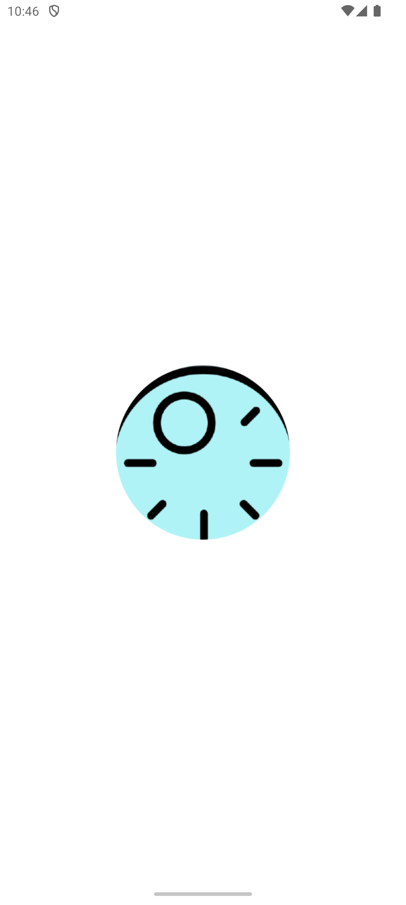</td>
    <td></td>
    <td>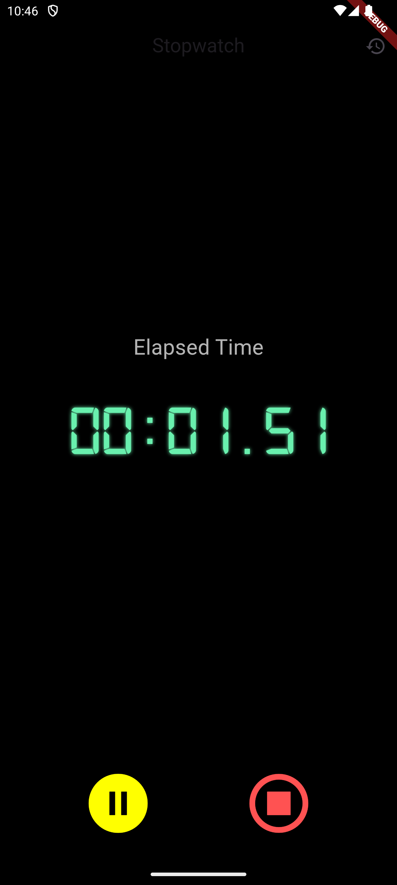</td>
    <td>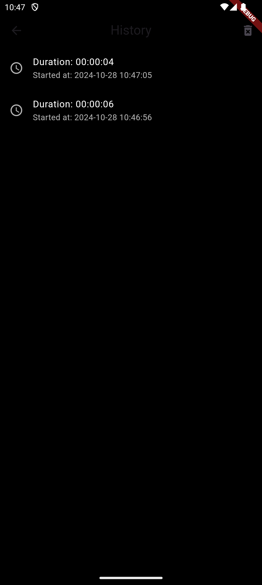</td>
  </tr>
</table>

# expense_tracker_app

# Screenshots

<table>
  <tr>
    <td>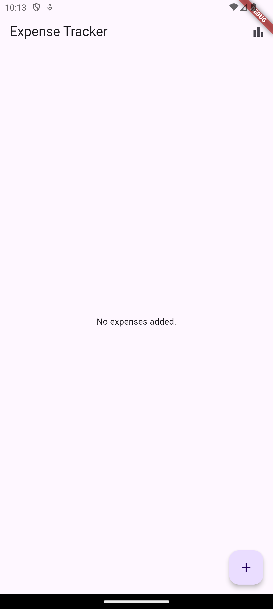</td>
    <td>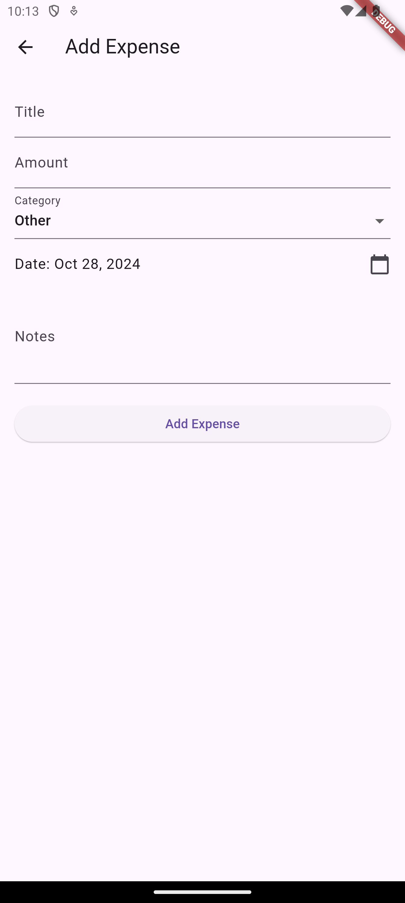</td>
    <td>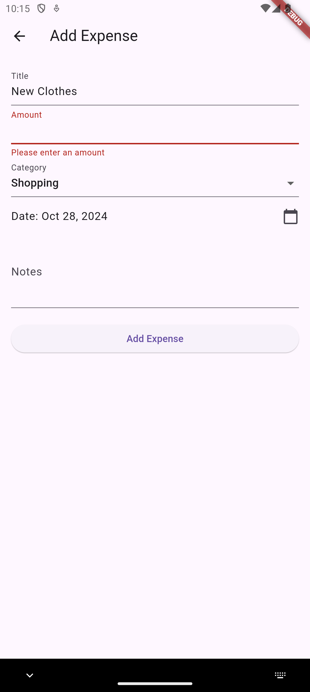</td>
    <td>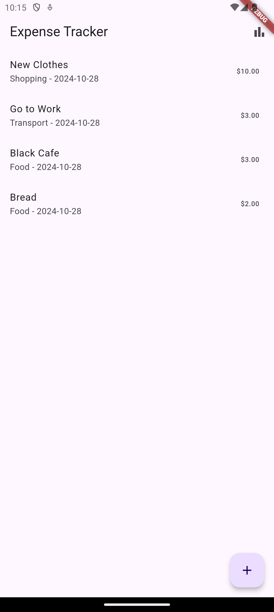</td>
  </tr>
  <tr>
    <td>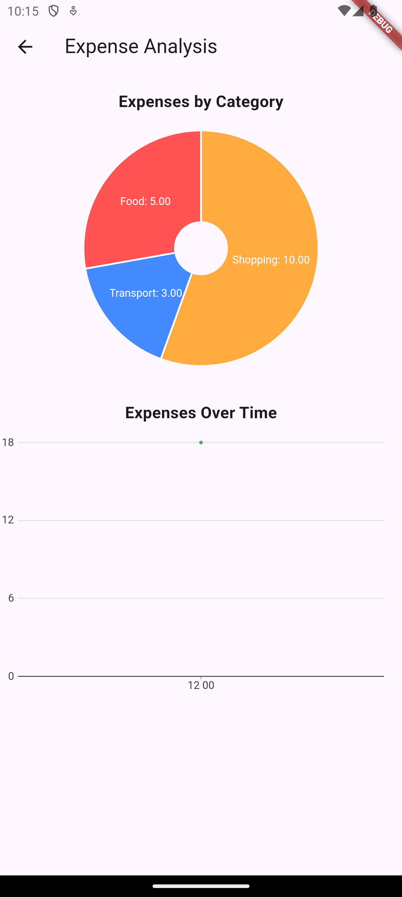</td>
    <td>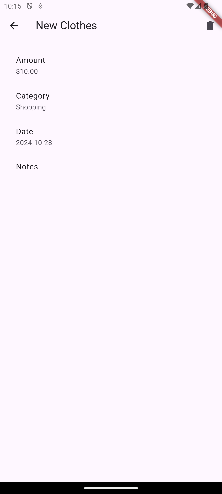</td>
    <td>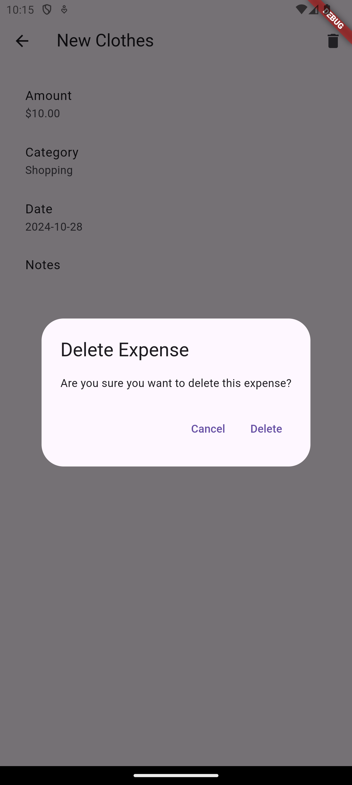</td>
    <td></td>
  </tr>
</table>

# bloc_reactive_form_demo

# Screenshots

<table>
  <tr>
    <td>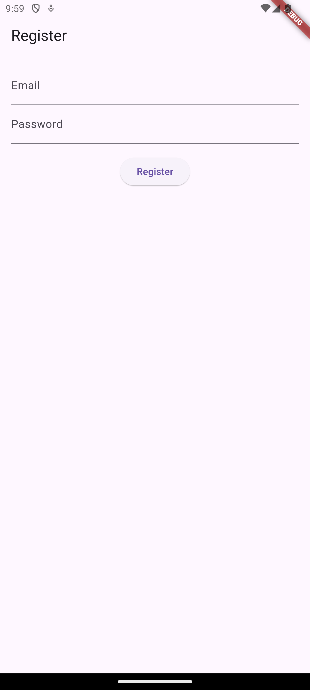</td>
    <td>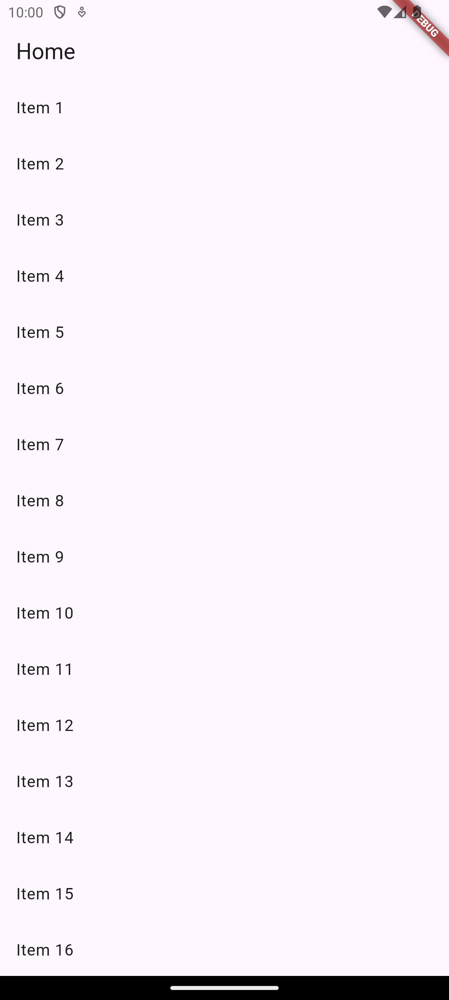</td>
  </tr>
</table>

# todo_bloc_app

# Screenshots

<table>
  <tr>
    <td>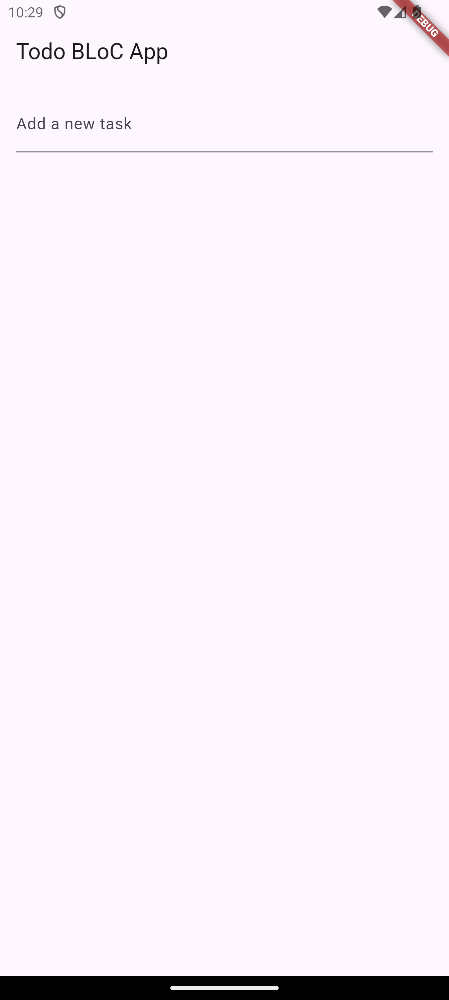</td>
    <td>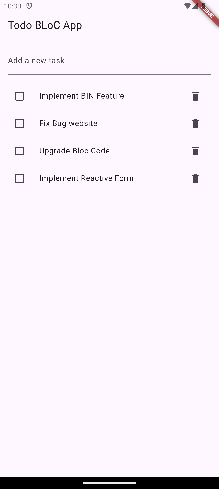</td>
    <td>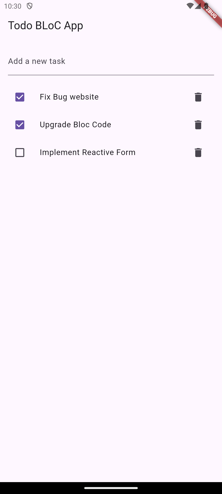</td>
  </tr>
</table>

# login_bloc_app

# Screenshots

<table>
  <tr>
    <td>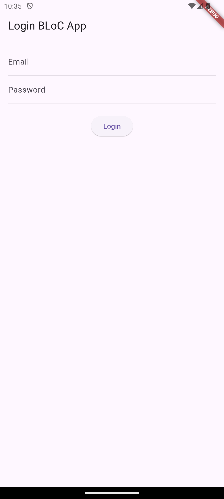</td>
    <td>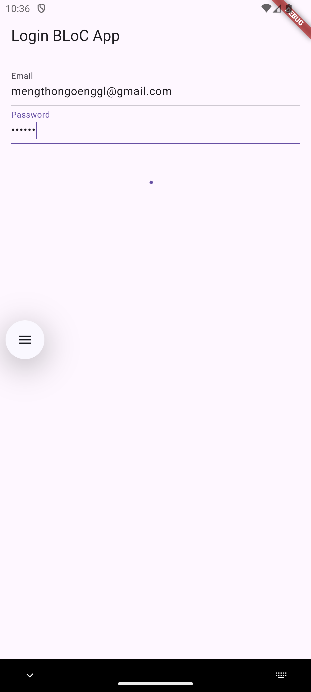</td>
    <td>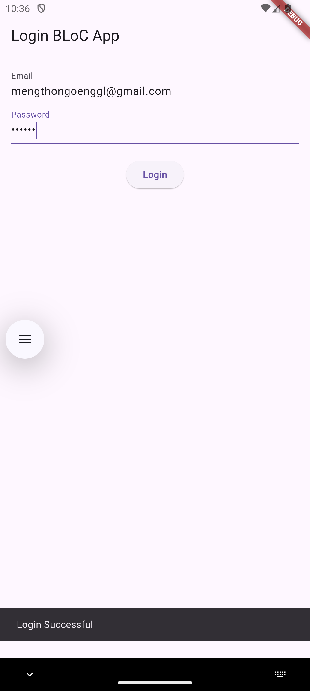</td>
  </tr>
</table>

# weather_bloc_app

# Screenshots

<table>
  <tr>
    <td>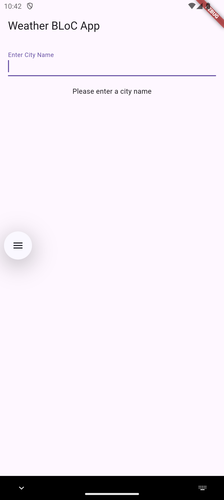</td>
    <td>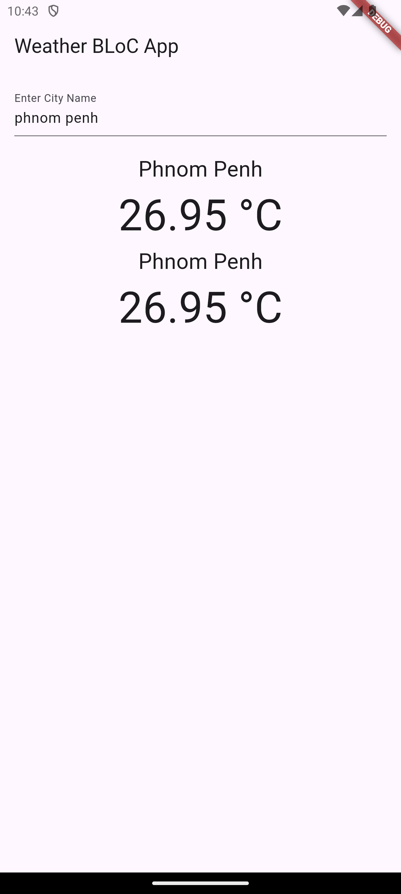</td>
  </tr>
</table>

